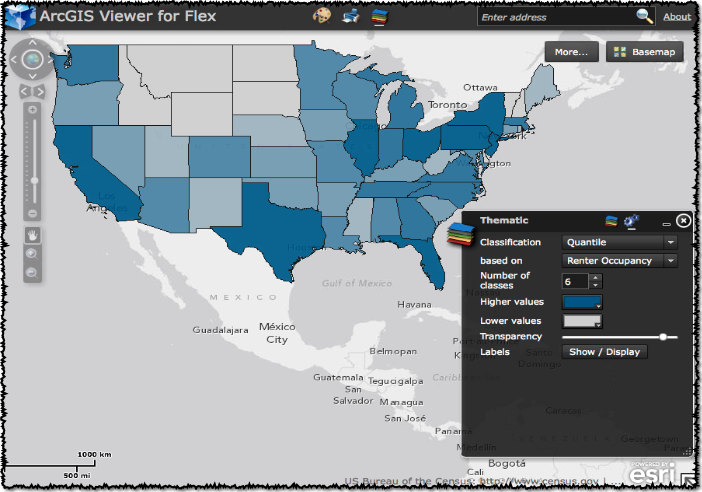

# thematic-widget-flex
<!-- short description -->
This is the thematic widget source code compatible with the [arcgis-viewer-flex (ArcGIS Viewer for Flex)](https://github.com/Esri/arcgis-viewer-flex "View repository on GitHub") application.

<!-- thumbnail with hyperlink -->

<!-- repository description -->
This repository includes:

* The [widget source code](viewer-ThematicWidget/src/widgets/Thematic) to showcase how to dynamically generate symbology from an [ArcGIS service](http://sampleserver6.arcgisonline.com/arcgis/rest/services/Census/MapServer) and use that symbology with a dynamic map service.
* A [non-widget sample](samples-Thematic/src) to showcase how to dynamically generate symbology from an [ArcGIS service](http://sampleserver6.arcgisonline.com/arcgis/rest/services/Census/MapServer) and use that symbology with a dynamic map service.
* The [Change Log](CHANGELOG.md) containing details about the repo history.
* The [Documentation](../../wiki) for getting started using this repository.
* The latest development is always on the [develop branch](../../tree/develop).
* The latest release is always on the [master branch](../../tree/master).

Who is this code sample for?  You're looking for an example how to convert an API sample into a widget.  You'd like a sample that provides a starting template for most widgets.  You're interested in how to package widgets for [Application Builder](http://resources.arcgis.com/en/help/flex-viewer/concepts/index.html#//01m30000002v000000).

## Features
* This widget showcases the power of ArcGIS and its ability to provide real-time interactive thematic mapping and labeling through an [ArcGIS service](http://sampleserver6.arcgisonline.com/arcgis/rest/services/Census/MapServer).  
* Using this widget, you can:
    * Interactively select different classification methods.
    * Interactively select different classification fields.
    * Modify the number of classes, color ramps, transparency, and labeling.
    * Apply all of these changes at run-time to a live dynamic ArcGIS service.
* Want to see how you take an example of a [custom widget template](../../tree/CustomWidgetTemplate-Begin), apply an [ArcGIS API for Flex sample](samples-Thematic/src/GenerateRenderer.mxml), and package the [completed custom widget](../../tree/CustomWidgetTemplate-End) for distribution with the [Application Builder](http://resources.arcgis.com/en/help/flex-viewer/concepts/index.html#//01m30000002v000000)?  Then you should keep reading.
* This code sample provides one example of a [code template for a custom widget](../../tree/CustomWidgetTemplate-Begin), as well as a [finished custom widget](../../tree/CustomWidgetTemplate-End) that has integrated the ["Generate Renderers" sample](samples-Thematic/src/GenerateRenderer.mxml) from the [ArcGIS API for Flex Resource Center](http://links.esri.com/flex).

## Instructions
How are you going to integrate this widget in your own application?

1.  If you are simply going to use the compiled "ready-to-use" version of the ThematicWidget packaged for the [ArcGIS Viewer for Flex Application Builder](http://resources.arcgis.com/en/help/flex-viewer/concepts/index.html#//01m30000002v000000 "Getting started with Application Builder") proceed to the [documentation for Application Builder](../../wiki/Application-Builder) section.
  
2.  If you are going to compile this widget on your own, make modifications, etc., proceed to the [documentation for Developers](../../wiki/Developers) section.

## Requirements
* Knowledge of Flex development.
* A little background with Adobe&reg;/Apache Flex&reg; SDK.
* Experience with the [ArcGIS API for Flex](http://links.esri.com/flex) would help.
* ArcGIS 10.1 or later required for dynamic layer support.
    * [About dynamic layers](http://resources.arcgis.com/en/help/main/10.1/00sq/00sq000000n1000000.htm)
    * [Enabling dynamic layers](http://resources.arcgis.com/en/help/main/10.1/index.html#/Enabling_dynamic_layers_on_a_map_service_in_Manager/00sq000000qv000000/)
    * [Supported functionality in dynamic layers](http://resources.arcgis.com/en/help/main/10.1/00sq/00sq00000083000000.htm#ESRI_SECTION1_1E08135AC774438F85FAA53EBF898A7B)

## Resources
* [ArcGIS Viewer for Flex Resource Center](http://links.esri.com/flexviewer)
* [ArcGIS API for Flex Resource Center](http://links.esri.com/flex)
* [Flex Viewer License agreement](http://www.apache.org/licenses/LICENSE-2.0.html)
* [Flex API License agreement](http://www.esri.com/legal/pdfs/mla_e204_e300/english.pdf)
* [ArcGIS Blog](http://blogs.esri.com/esri/arcgis/tag/flex/)
* [@lheberlie](http://twitter.com/lheberlie)

## Issues
Ask questions on the [Thematic Widget Forum](http://forums.arcgis.com/threads/76036-thematic-widget-flex "ThematicWidget Forum").

Find a bug or want to request a new feature?  Please let us know by [submitting an issue](../../issues "Submit an Issue").

## Contributing
Esri welcomes [contributions](CONTRIBUTING.md) from anyone and everyone. Please see our [guidelines for contributing](https://github.com/esri/contributing).

## Licensing
Copyright 2013 Esri

Licensed under the Apache License, Version 2.0 (the "License");
you may not use this file except in compliance with the License.
You may obtain a copy of the License at

http://www.apache.org/licenses/LICENSE-2.0

Unless required by applicable law or agreed to in writing, software
distributed under the License is distributed on an "AS IS" BASIS,
WITHOUT WARRANTIES OR CONDITIONS OF ANY KIND, either express or implied.
See the License for the specific language governing permissions and
limitations under the License.

A copy of the license is available in the repository's [license.txt](license.txt) file.

